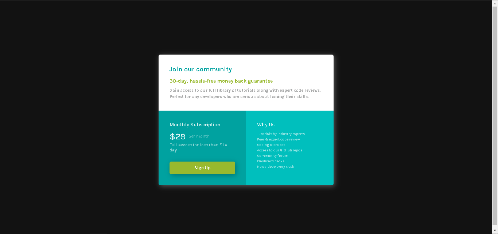
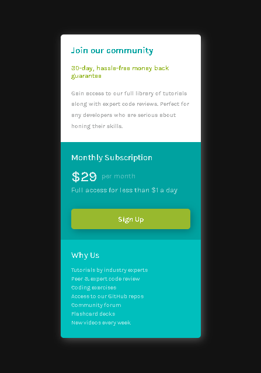

# Frontend Mentor - Single price grid component solution

This is a solution to the [Single price grid component challenge on Frontend Mentor](https://www.frontendmentor.io/challenges/single-price-grid-component-5ce41129d0ff452fec5abbbc). Frontend Mentor challenges help you improve your coding skills by building realistic projects. 

## Table of contents

- [Overview](#overview)
  - [The challenge](#the-challenge)
  - [Screenshot](#screenshot)
  - [Links](#links)
- [My process](#my-process)
  - [Built with](#built-with)
  - [What I learned](#what-i-learned)
  - [Continued development](#continued-development)
  - [Useful resources](#useful-resources)
- [Acknowledgments](#acknowledgments)

## Overview

### The challenge

Users should be able to:

- View the optimal layout for the component depending on the device's screen size
- See a hover state on the desktop for the Sign-Up call-to-action

### Screenshot

### Links

- Solution URL: 
- Live Site URL: 

## My process

### Built with

- HTML 
- CSS
- Flexbox
- Mobile-first workflow

### What I learned

I have learned the basics of Flexbox for this challenge. This is the starting point of my web development journey, and I want to learn more about it.

### Continued development

I want to learn more about front-end web development before moving to back-end web development.

### Useful resources

- [Resource 1](https://www.youtube.com/watch?v=zJSY8tbf_ys&t=69668s) - This helped me learn the basics of front-end development.
- [Resource 2](https://www.cssmatic.com/box-shadow) - This helped me to generate box shadow in CSS.
- [Resource 3](https://yoksel.github.io/flex-cheatsheet/) - This helped me when I forgot something about Flexbox.
- [Resource 4](https://chromewebstore.google.com/detail/colorpick-eyedropper/ohcpnigalekghcmgcdcenkpelffpdolg) - This chrome extension helped me in picking the color hex value of the design provided in this challenge.

## Acknowledgments
I would like to express my deepest gratitude to the following:
- [YouTube Video Title](https://www.youtube.com/watch?v=zJSY8tbf_ys&t=69668s): For providing a comprehensive introduction to front-end development, which laid the foundation for my learning journey.
- Frontend Mentor: For offering a valuable platform and the opportunity to work on free challenges, helping me to practice and refine my skills.
- My friends, family, and especially my mom: For their unwavering support and encouragement, which inspires me every day to continue learning and growing in my field.
